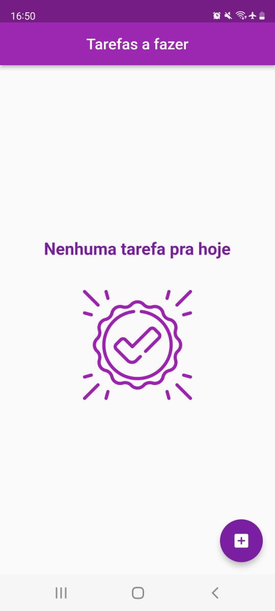
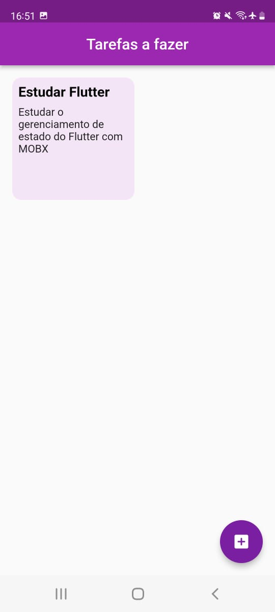
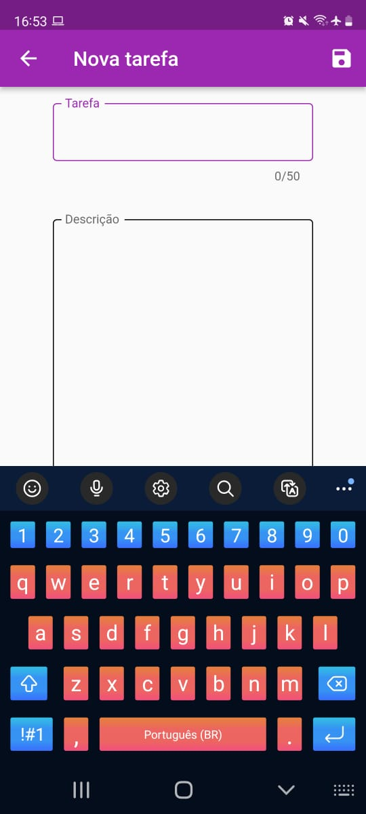
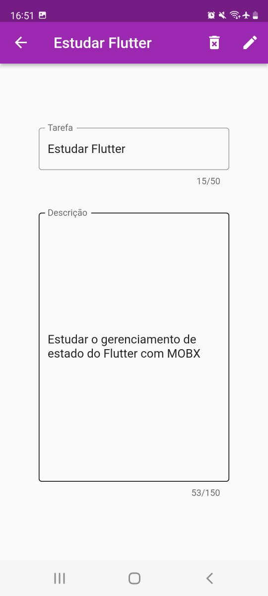

<h1 align="center"> 
	:notebook: Lista de Tarefas :notebook:
</h1>

<h4 align="center"> 
	🚧   Concluído   🚧
</h4>

---

<h2>💻 Sobre o projeto</h2>

	É uma aplicação desenvolvida com o objetivo de criar, ler, editar e apagar tarefas.
	 
	O projeto foi desenvolvido como forma avaliativa do curso Fundamentos de Flutter ofertado pela Dell EAD em parceria com a UECE.

 

---

<h2>⚙️ Funcionalidades</h2>
<h4>Os usuários que acessam o aplicativo podem:</h4>

  - [x] Ver todas as tarefas criadas.
  - [x] Ver uma tarefa específica.
  - [x] Editar ou apagar uma tarefa existente.
 

---

<h2>🎨 Telas</h2>

<h4>O aplicativo conta com 3 telas, sendo elas:</h4>

<table>
    <tr>
      <td>Tela Inicial<h6>Quando não existem tarefas a serem exibidas</h6></td>
      <td>Tela Inicial<h6>Quando existem tarefas a serem exibidas</h6></td>
			<td>Tela de Criação<h6>São criadas com título e descrição</h6></td>
      <td>Tela de Visualização<h6>Com os botões de Edição e Deleção</h6></td>
    </tr>
    <tr>
      <td></td>
      <td></td>
      <td></td>
      <td></td>
    </tr>
</table>

 

---

## 🛠 Tecnologias

As seguintes ferramentas foram usadas na construção do projeto:

### **Aplicativo**

- **Flutter**
  -  MOBX
  		-  Utilizado para o gerenciamento do estado da aplicação e simulação do CRUD nas tarefas. 

---

<h2>
	:bookmark_tabs: Licença
</h2>
<h4>
	Este projeto esta sobe a licenca <a target="_blank" href="./LICENSE">MIT</a>
</h4>

<h2>
	👨‍💻 Autor
</h2>

 
	

<h4 align="center">
	Feito por Matheus Santana
	 
	<a target="_blank" href="https://www.linkedin.com/in/mdasantana/">Entre em contato!</a>
</h4>
