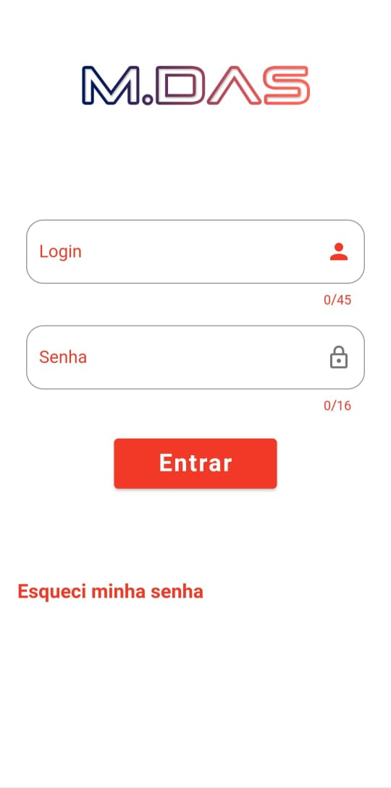
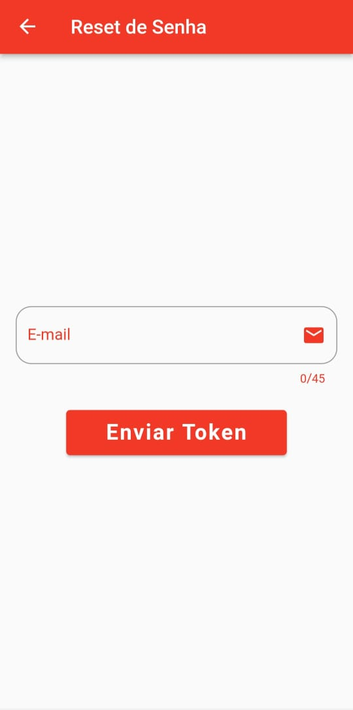
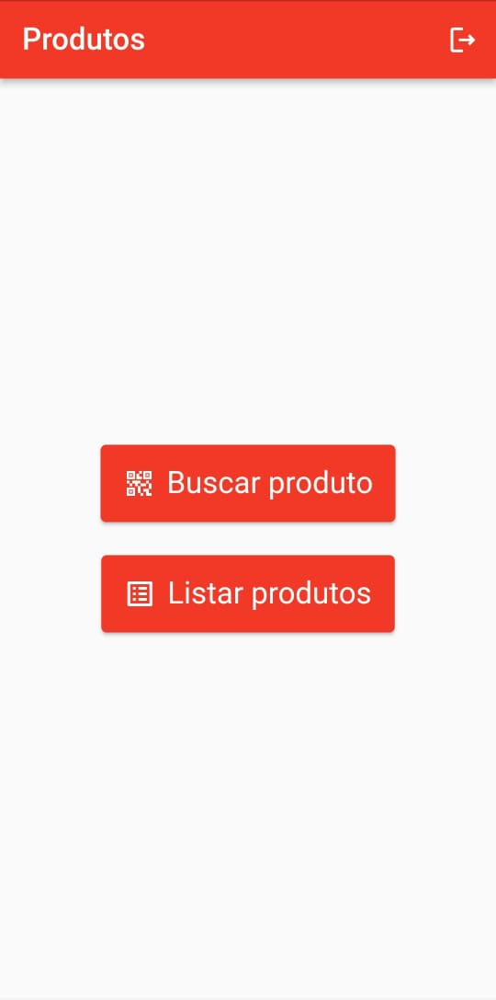
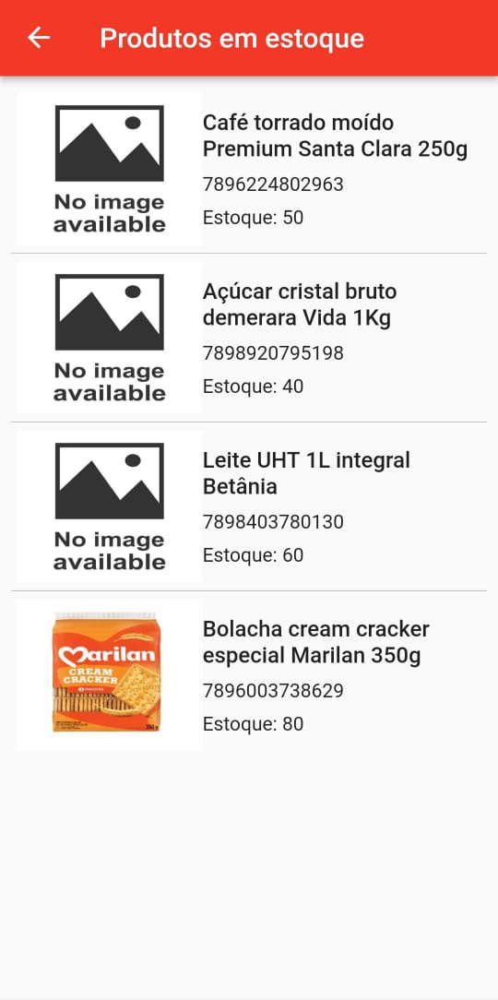
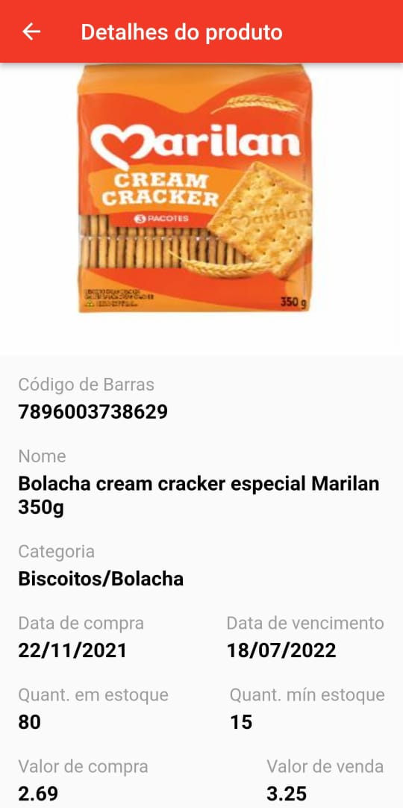

<h1 align="center"> 
	📦   M.DAS Estoque   📦 
</h1>

<h4 align="center"> 
	🚧   Concluído   🚧
</h4>

---

<h2>💻 Sobre o projeto</h2>

	É uma aplicação desenvolvida com o objetivo de visualizar as informações dos produtos/materiais armazenadas no banco de dados.
	 
	O projeto foi desenvolvido como forma avaliativa da disciplina de Desenvolvimento de Sistemas Mobile do curso de Desenvolvimento de Sistemas do SENAI-BA.

 

<h2>⚙️ Funcionalidades</h2>
<h4>Os usuários acessam o aplicativo podem:</h4>

  - [x] Realizar login e logout da aplicação.
  - [x] Listar todos os produtos em estoque.
  - [x] Buscar um produto específico ao escanear o código de barras.
  - [x] Ver as informações dos produtos.
 

<h2>🎨 Telas</h2>

<h4>O aplicativo conta com 5 telas, sendo elas:</h4>

<table>
    <tr>
      <td>Login<h6>   </h6></td>
      <td>Reset de Senha<h6>   </h6></td>
      <td>Tela Principal<h6>Buscar via cod. barras ou todos os produtos</h6></td>
      <td>Lista de Produtos<h6>   </h6></td>
      <td>Detalhes do Produto<h6>   </h6></td>
    </tr>
    <tr>
      <td></td>
      <td></td>
      <td></td>
      <td></td>
      <td></td>
    </tr>
</table>

 

## 🛠 Tecnologias

As seguintes ferramentas foram usadas na construção do projeto:

### **Banco de Dados**

-   **Banco Usuários**
	- Utilizado o Firebase Authentication para armazenar as informações dos usuários e fazer as validações de acesso.
-   **Banco Produtos**
	- Utilizado o Firebase Cloud Firestore para armazenar as informações dos produtos.

### **API**

- **NodeJS**
	-   A API foi construída utilizando o NODE.js versão 14.16.1 e o Firebase Functions para disponibiliza-la na WEB.

### **Aplicativo**

- **Flutter**
  -   Utilizado para construir o aplicativo.
 

<h2>
	:bookmark_tabs: Licença
</h2>
<h4>
	Este projeto esta sobe a licenca <a target="_blank" href="./LICENSE">MIT</a>
</h4>

 

<h2>
	👨‍💻 Autor
</h2>

 
	

<h4 align="center">
	Feito por Matheus Santana
	 
	<a target="_blank" href="https://www.linkedin.com/in/mdasantana/">Entre em contato!</a>
</h4>
